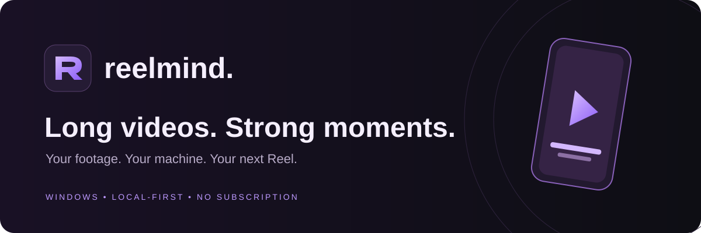
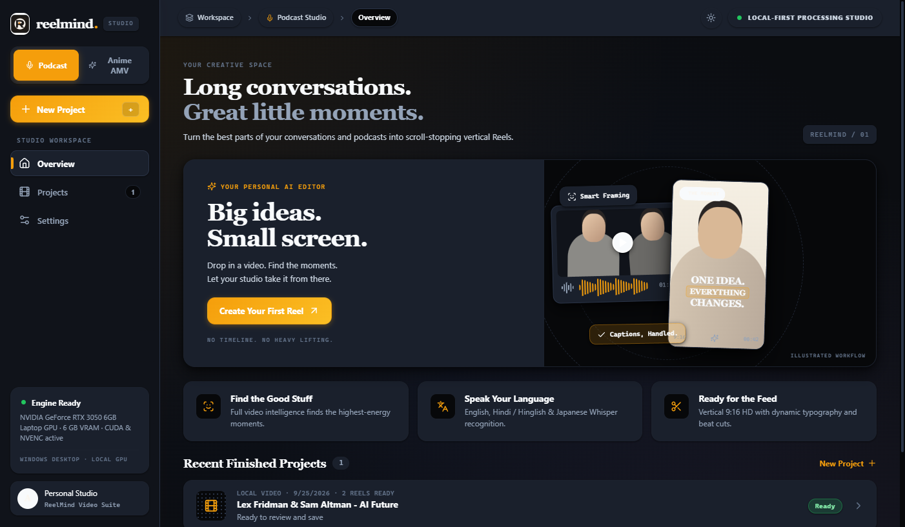
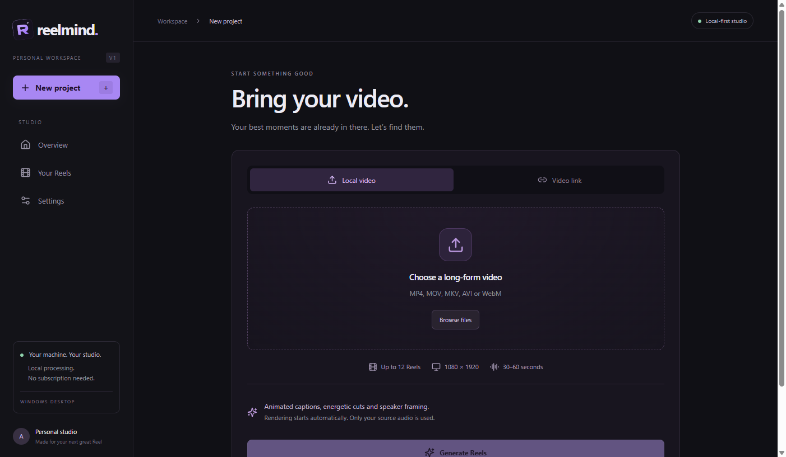
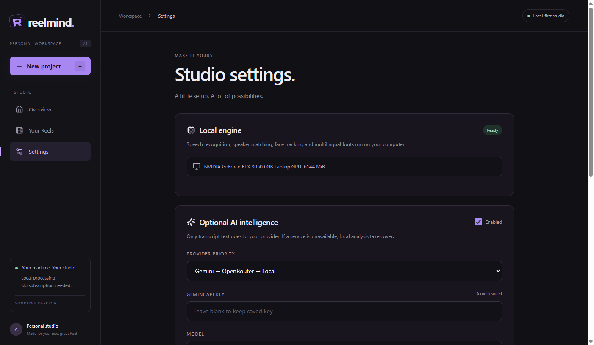
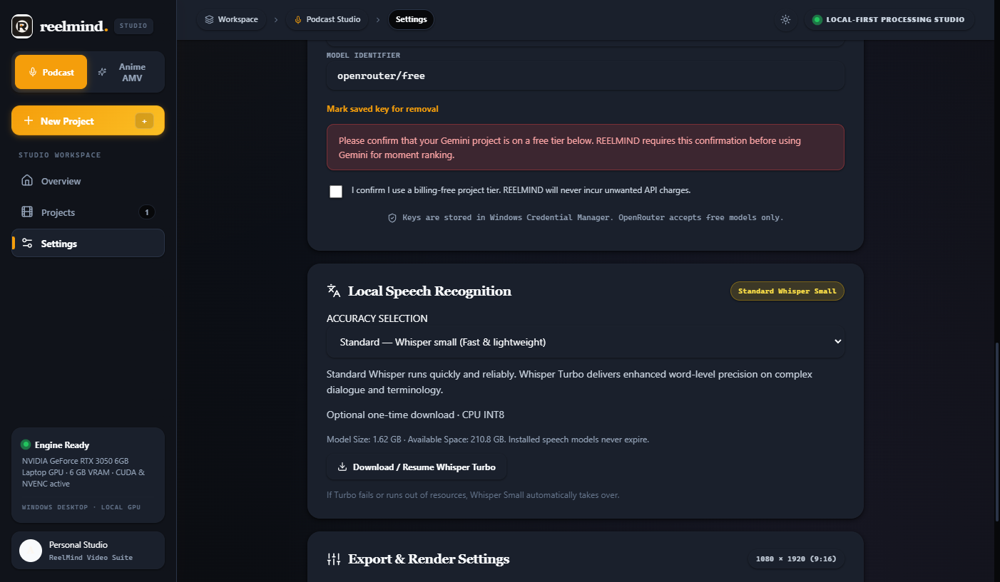
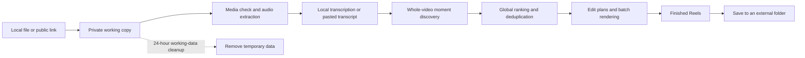
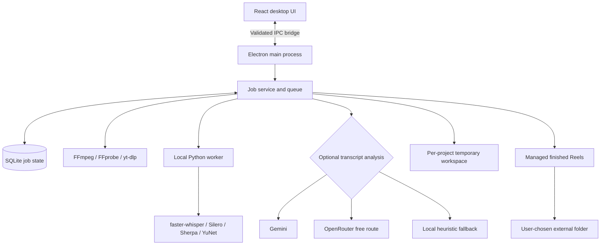

# REELMIND

**A personal, Windows-only studio for turning long videos into Instagram-ready Reels.** Import a local video or public link, let the app find strong moments, and save the finished vertical clips wherever you want. No timeline editor, subscription, added music, or developer tools are needed for the installed app.

[Download the Windows installer](https://github.com/yushy07/reelmind/releases/tag/v0.2.0) · [Report a problem](https://github.com/yushy07/reelmind/issues) · [Security and privacy](SECURITY.md)

> **Current release:** [v0.2.0 is a personal-use prerelease](https://github.com/yushy07/reelmind/releases/tag/v0.2.0). The installer is unsigned, and real Hindi/Hinglish, Japanese, and mixed-language evaluation is still in progress. The Windows installer includes the local engine, models, fonts, and media tools; the separate `REELMIND.exe` inside an unpacked build is not a standalone download.

> **Source status:** the repository matches the v0.2.0 prerelease source. Optional Whisper Turbo and pasted-transcript input are included in that release. The earlier v0.1.0 and v0.1.1 downloads remain available.

**Moving to another Windows PC?** Download **`REELMIND.Setup.0.2.0.exe`** from the [v0.2.0 prerelease](https://github.com/yushy07/reelmind/releases/tag/v0.2.0), run it once, then add your own Gemini/OpenRouter keys in the app's Settings if you want cloud analysis. No keys are included in the installer, and keys are optional because local analysis works without them. GitHub's **Code → Download ZIP** is source code only; it does not contain the installer or bundled runtime. To use that ZIP, follow [Build from source](#build-from-source) instead.

## Inside the app



| New project | Local engine and settings |
| --- | --- |
|  |  |

Screenshots are from the desktop app. The Settings image contains no API keys.

## What it makes

### Model upgrade (v0.2.0)

- **MiniLM** compares the actual transcript of up to 96 candidate moments before choosing at most 12 distinct clips. It runs offline with the bundled quantized model. If inference fails, text-based deduplication takes over.
- **Standard / Whisper small** remains the default. In Settings, optionally download **Whisper turbo** (about 1.62 GB plus 512 MB free-space margin), then select Higher accuracy and save settings. Turbo runs on CPU INT8 initially, so no additional NVIDIA libraries are needed.
- **Optional pasted transcript:** On New Project, paste plain text or timestamped SRT/VTT instead of relying on speech recognition. SRT/VTT cue times are retained; word timings are estimated within each cue. Plain text is spread across the video duration, so use timestamped cues when timing matters. Leave the box empty to use local Whisper.
- Turbo downloads are checksum-verified, can be paused/resumed, and become available offline only after verification. A failed Turbo worker retries with small. Each project keeps its chosen mode when resumed.
- Installed models are separate from 24-hour project cleanup. Abandoned partial downloads expire after 24 hours; completed models do not. No model weights, test media or credentials are committed to Git.
- This is not a promise that Turbo improves every recording: multilingual accuracy and timing still depend on the source.



See [model upgrade validation](docs/MODEL_UPGRADE_VALIDATION.md) for completed checks and remaining language evaluation. This prerelease is available for early use; v0.1.0 and v0.1.1 remain unchanged.

- Up to **12** automatically selected Reels per video; fewer are fine, and weak moments are not added to meet a quota.
- **30–60 seconds** each, exported as **1080 × 1920 MP4** with H.264 video and AAC audio.
- Burned-in animated captions, punch-ins, speaker-aware framing, and source-audio-only sound.
- English, Hindi/Hinglish, and Japanese are the first target languages. Captions follow the transcribed speech where possible.
- Finished Reels are final in V1: there is no in-app editing, cover, hashtag, or post-caption generator.

## Install and use

1. Download and run **`REELMIND.Setup.0.2.0.exe`** from the [v0.2.0 prerelease](https://github.com/yushy07/reelmind/releases/tag/v0.2.0).
2. Open **REELMIND** from the desktop shortcut or Windows Start menu.
3. Choose **New project**, then a local MP4, MOV, MKV, AVI, or WebM file, or a public YouTube/direct-video HTTPS link. Optionally paste a transcript in the same screen: plain text or timestamped SRT/VTT. Select **Generate Reels**.
4. When processing finishes, open **Your Reels** and choose **Save Reels**. Select a folder outside the app's installation and data folders. REELMIND verifies each saved file before removing its internal copy.

The app accepts public, non-live, non-DRM links; it does not bypass authentication, paywalls, or site restrictions. Your original local video is never modified.

## How a video becomes Reels



1. **Import:** FFprobe checks the source; local files are copied into a private project workspace, while supported public links are downloaded with yt-dlp.
2. **Understand:** FFmpeg extracts audio. If no transcript was pasted, faster-whisper transcribes locally with word timestamps. Otherwise, REELMIND parses the pasted text and uses cue times or estimates timing from video duration. Silero VAD finds speech, Sherpa ONNX estimates speaker changes, and OpenCV YuNet detects faces.
3. **Find moments:** Overlapping transcript sections produce candidates. Gemini is tried first, then OpenRouter, then local heuristic analysis. Candidates are ranked across the complete video and overlapping/repeated moments are removed.
4. **Edit and render:** Versioned edit plans drive captions, framing, cuts, and zooms. FFmpeg renders in batches of up to three clips, one heavy render at a time. NVIDIA NVENC is tried when available; software H.264 is the fallback.
5. **Save and clean up:** A Windows notification announces completion. Unsaved finished Reels remain available; non-output working data expires after 24 hours. Interrupted jobs can be resumed within their 24-hour recovery window.

## Architecture



| Area | Main files | Responsibility |
| --- | --- | --- |
| Desktop UI | `src/` | Home, import, processing, results, and settings screens |
| Electron boundary | `electron/main.ts`, `electron/preload.ts` | Window, dialogs, notifications, and validated renderer calls |
| Jobs and storage | `electron/service.ts`, `electron/storage.ts` | Pipeline, checkpoints, SQLite state, save verification, and cleanup |
| Analysis and editing | `electron/providers.ts`, `electron/core.ts`, `electron/media.ts` | Provider fallback, clip selection, edit plans, and rendering |
| Local worker | `workers/worker.py` | Transcription, voice/speaker features, and face analysis |
| Packaged tools | `runtime/` | Local executables, models, and fonts; generated locally, not committed |

### Privacy and provider fallback

The local media pipeline keeps the video and extracted audio on your computer. A pasted transcript is stored temporarily in that project's private workspace and is not uploaded as a file. If optional cloud analysis is enabled, transcript text (including pasted text), timestamps, and structured metadata are sent to the selected provider for clip analysis. Gemini and OpenRouter keys are stored in **Windows Credential Manager**, not the repository or SQLite. You can use the app with no keys; local analysis takes over if a provider is unavailable or returns invalid output.

The Settings screen accepts only OpenRouter's `openrouter/free` route or model IDs ending in `:free`. Gemini use requires you to confirm that billing is disabled on your own API project; REELMIND cannot verify that setting for you. Free-provider quotas and availability can change.

## Storage and recovery

| Data | What happens |
| --- | --- |
| Original local video | Never edited or automatically deleted |
| Copied/downloaded source, audio, generated or pasted transcript, plans, cache | Stored in a private project workspace; removed 24 hours after completion or interruption |
| Interrupted project | Shows a recovery countdown; resume reuses verified completed stages where possible |
| Unsaved finished Reels | Kept in managed app storage until you save or explicitly delete them |
| Externally saved Reels | Verified before the internal copy is removed; never targeted by automatic cleanup |

Cleanup checks run while the app is open and again at startup, so an expiry that passes while the app is closed is handled on the next launch. Closing the app during processing pauses the job. Explicitly deleting a project also deletes any unsaved internal Reels, after an in-app confirmation.

## Build from source

Development requires **64-bit Windows**, Node.js 24 or newer, Git, and enough free space for the runtime (roughly 2 GB plus video working space).

```powershell
git clone https://github.com/yushy07/reelmind.git
cd reelmind
npm ci
npm run setup:runtime
npm run build
npm start
```

`npm run setup:runtime` downloads the portable local worker runtime, FFmpeg, yt-dlp, models, and fonts. To make an installer after setup, run `npm run package`; the NSIS Setup EXE is written to `release/`. A signing certificate is not included.

For checks, use `npm test`, `npm run typecheck`, `npm run check:secrets`, and `node scripts/run-electron-smoke.mjs`. Integration fixtures are available in `scripts/`; generated test media and screenshots stay under Git-ignored `.test-data/`.

## Current limits

Real multilingual and multi-speaker podcast evaluation is still needed. Speech recognition and active-speaker framing can be wrong around overlapping voices, very short turns, rapid language switching, or scene cuts. Local heuristic ranking is less capable than a strong cloud model; neither mode guarantees a great editorial choice. Public-link support depends on third-party sites and may need tool updates. V1 has no manual caption correction after rendering.

The [MiniLM and optional Whisper Turbo plan](docs/MINILM_TURBO_PLAN.md) records the implementation scope; the [validation report](docs/MODEL_UPGRADE_VALIDATION.md) tracks completed checks and remaining release gates. These upgrades and pasted-transcript input are included in the v0.2.0 prerelease installer; v0.1.0 and v0.1.1 remain available as earlier releases.

## License, credits, and safety

Copyright **2026 Ayush Kant**. Original REELMIND code and branding are licensed under the [Apache License 2.0](LICENSE). Bundled third-party tools, models, and fonts retain their own licenses; see [NOTICE](NOTICE), [third-party notices](THIRD_PARTY.md), and [redistribution details](THIRD_PARTY_LICENSES.md).

Never place API keys, personal videos, workspaces, local databases, or installer artifacts in Git. The repository ignores generated and private data; `npm run check:secrets` adds a safeguard before sharing changes. See [SECURITY.md](SECURITY.md) for reporting and diagnostic guidance.
