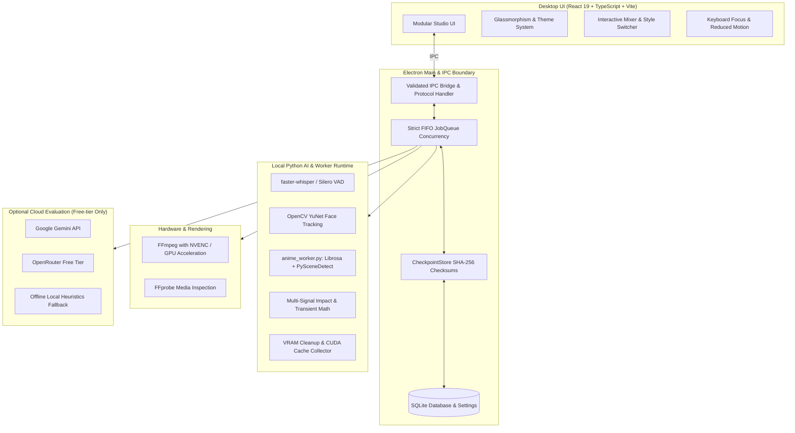
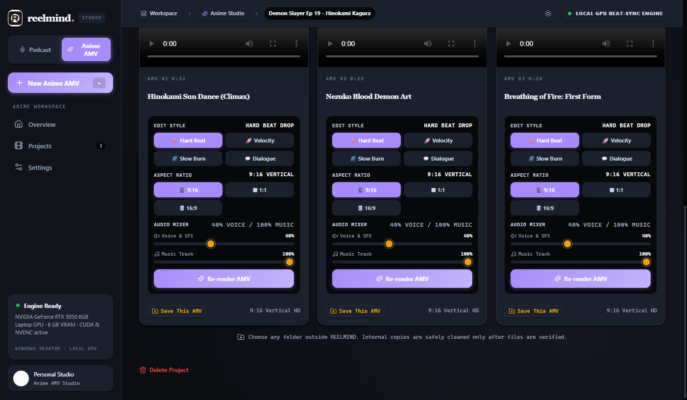
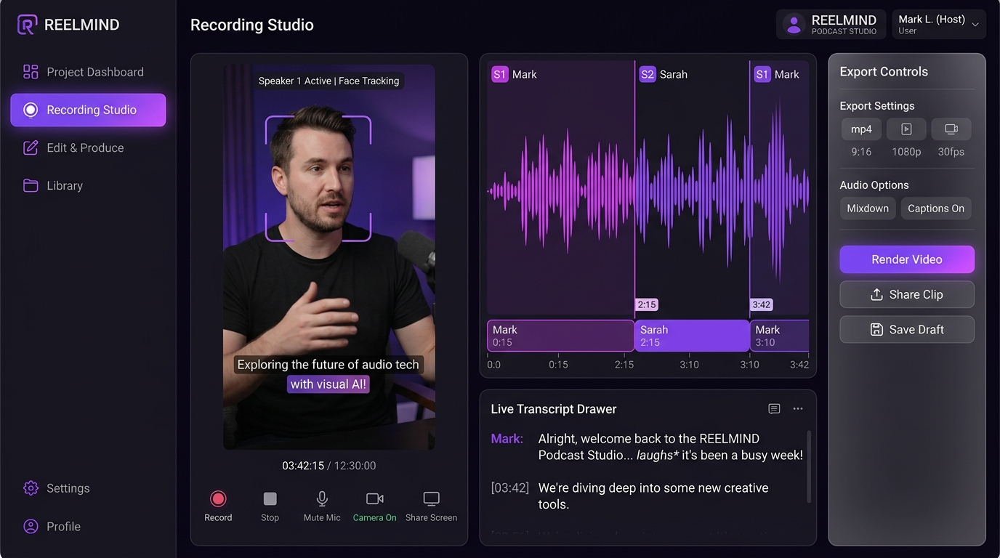

<div align="center">

# REELMIND STUDIO
### A Personal, Local-First Instagram Reels & Anime AMV Studio for Windows

[](https://github.com/yushy07/reelmind/releases/tag/v0.3.1)
[-0078d4?style=for-the-badge&logo=windows)](https://github.com/yushy07/reelmind)
[](LICENSE)
[](SECURITY.md)
[](tests/)
[](src/styles/theme.css)

<p align="center">
  <a href="#-quick-download">Download Installer</a> •
  <a href="#-two-specialized-creative-studios">Two Dedicated Studios</a> •
  <a href="#-architectural-pillars--hardening">Architecture & Hardening</a> •
  <a href="#-interactive-studio-workspace">Studio Workspace</a> •
  <a href="#-build-from-source">Build from Source</a> •
  <a href="#-privacy--storage">Privacy & Security</a>
</p>

</div>

---

**REELMIND** is a personal, Windows-native desktop studio engineered to transform long-form content into viral, feed-ready vertical video (9:16). Whether distilling hour-long podcast conversations into punchy captioned Reels or decomposing 24-minute anime episodes into beat-synced AMVs, REELMIND executes visual intelligence, speech recognition, and video rendering **entirely on your local GPU/CPU**.

> **No cloud subscriptions. No manual timeline editing. 100% offline-first. Your originals remain untouched.**

---

## ⚡ Two Specialized Creative Studios

REELMIND features two dedicated creative workspaces switchable via the segmented studio tab:

### 🎙️ 1. Podcast Studio
*Designed for dialogue-driven conversations, interviews, presentations, and educational videos.*

- **Multilingual Whisper Speech Recognition**: Native speech transcription using `faster-whisper` (Standard Whisper Small or high-speed Whisper Turbo) across English, Hindi/Hinglish, and Japanese.
- **Active-Speaker Neural Face Tracking**: Powered by OpenCV YuNet neural face detection and Sherpa ONNX speaker embeddings to track active subjects and dynamically pan/frame them within vertical 9:16 boundaries.
- **Semantic Candidate Ranking**: MiniLM local vector embeddings compare candidate moments across the full video before selecting up to 12 distinct, high-retention clips.
- **Burned-in Animated Word Captions**: High-contrast, dynamic animated captions synced to precise word timestamps with customizable styling and ASS subtitle compilation.
- **Optional Pasted Transcript & Subtitle Imports**: Paste plain text or timed `.srt` / `.vtt` captions directly to bypass or assist speech recognition.

---

### 🎌 2. Anime Studio
*Engineered to turn 24-minute anime episodes and music tracks into rhythm-locked, high-energy 9:16 AMVs.*

- **Full Episode Ingestion**: Ingests full 24-minute Japanese (original audio) or English dub episodes alongside any external audio track (`.mp3`, `.wav`, `.flac`, `.aac`).
- **Scene & Shot Decomposition**: PySceneDetect + FFmpeg analyze shot transitions, content shifts, and camera cuts into a structured SQLite database.
- **Librosa Audio Beat-Grid Analysis**: Computes exact BPM, beat points, downbeats, and onset energy envelopes to align cuts strictly on musical beats.
- **Multi-Signal Visual Intelligence**:
  - Motion delta vectors (action intensity & dynamism)
  - Laplacian visual sharpness scoring
  - Anime character face scoring with fallback isolation
  - Audio transient bursts and dialogue detection
- **$T_{\text{impact}}$ Climax Synchronization**: Detects peak visual impact frames within shots, aligning action climaxes directly to music beat drops instead of generic cut points.
- **3–5 Diverse AMV Concepts**: Synthesizes diverse concepts categorized into `Action`, `Emotional`, `Dialogue`, and `Cinematic` vibes with $\ge 2.5$s temporal separation.
- **Dynamic 9:16 Character-Centered Camera**: Tracks character bounds ($X \in [0.28, 0.72]$) with smooth panning, zoom punch-ins, and dual-stream background depth-of-field blur (`isolateCharacter`).
- **Neural Motion & Color Effects**: Velocity ramping curves with temporal frame blending (`tblend`), impact flash transitions, and shake dynamics.
- **In-Studio Interactive Controls**:
  - **Edit Style Selector**: `⚡ Hard Beat Drop`, `🚀 Velocity Ramp`, `🌌 Slow Burn`, `💬 Dialogue Pause`
  - **Dual-Track Audio Mixer**: Anime Voice & SFX % vs. Music Track %
  - **One-click instant re-rendering**: Re-renders concepts in ~3–5s on local GPU.
- **VRAM Lifecycle Management**: Two-pass memory architecture ensures strict cleanup (`torch.cuda.empty_cache()` + `gc.collect()`), running smoothly on 4 GB / 6 GB GPUs (e.g., RTX 3050).

---

## 🛡️ Architectural Pillars & Hardening



1. **Strict FIFO Concurrency Engine (`JobQueue`)**:
   Prevents process over-subscription during batch ingestion and simultaneous renders. Ensures predictable memory usage and hardware safety.
2. **Immutable Checkpoint Integrity (`CheckpointStore`)**:
   Stage artifacts are sealed with SHA-256 checksums. Worker framing and diarization write to distinct artifacts (`diarization.json`) rather than mutating base transcripts in-place, eliminating checkpoint corruption and enabling instant, 100% idempotent resumes.
3. **Hardened Protocol Sandbox (`reel://`)**:
   Strict UUID validation (`uuidValidate`) and output path traversal guards reject unauthorized file access outside managed project directories.
4. **VRAM Safety & Leak Prevention**:
   Strict execution lifecycle cleanup (`gc.collect()` and `torch.cuda.empty_cache()` in Python workers) guarantees low VRAM footprints on consumer hardware.
5. **Secure Credential Vault**:
   Optional API keys for Gemini/OpenRouter free-tier evaluations are stored directly in **Windows Credential Manager** (`keytar`), never written to disk, SQLite, or Git.

---

## 🎨 Professional Dark Glassmorphism Design System

The application interface is styled with a modular, modern desktop aesthetic:
- **Solar Amber & Electric Violet Theming**: Distinct visual identities for Podcast Studio (solar amber glow) and Anime Studio (electric violet / cyberpunk neon).
- **Layered Obsidian Surfaces**: Deep OLED dark canvas (`#08090c` / `#0f1219`) with subtle radial illumination.
- **Physical Glassmorphism**: Specular highlights (`inset 0 1px 1px 0 rgba(255, 255, 255, 0.12)`), frosted backdrop blurs (`backdrop-filter: blur(16px)`), and delicate translucent borders.
- **Micro-Animations & Transitions**: Fluid card entrances, modal popups, and live radar activity beacon indicating active render states.
- **Full Accessibility**: High-contrast ratios, complete keyboard navigation (`:focus-visible`), standard CSS `line-clamp` compliance, and `@media (prefers-reduced-motion: reduce)` support.

---

## 📸 Interactive Studio Workspace

| 🎌 Anime AMV Studio (Beat-Synced 9:16 Edits) | 🎙️ Podcast Studio (Captioned Viral Reels) |
| :---: | :---: |
|  |  |

| 🚀 Rapid Project Ingestion | ⚙️ Offline Engine & Settings |
| :---: | :---: |
|  |  |

---

## 🔄 Media Processing Pipeline

```mermaid
flowchart LR
    A[Source Media<br/>Local Video or URL] --> B[Private Project Workspace]
    B --> C[Media Probe & Audio Extraction]
    C --> D{Studio Mode}
    
    D -->|Podcast Studio| E1[Whisper Speech Recognition]
    E1 --> E2[Face Tracking & Speaker Diarization]
    E2 --> E3[MiniLM Semantic Clip Ranking]
    E3 --> G1[Edit Plans: 9:16 Framing & Captions]
    
    D -->|Anime AMV Studio| F1[PySceneDetect Shot Decomposition]
    F1 --> F2[Librosa Beat Grid & Energy Analysis]
    F2 --> F3[Multi-Signal Impact Scoring]
    F3 --> F4[3–5 Diverse AMV Concepts]
    F4 --> G2[Beat-Aligned Cuts & Neural Effects]
    
    G1 --> H[FFmpeg GPU / NVENC Render]
    G2 --> H
    H --> I[Interactive Video Player]
    I --> J[Save to External Folder]
    
    B -. 24h Expiry .-> K[Automatic Scratch Cleanup]
```



---

## 📂 Source Structure

```text
REELMIND
├── src/
│   ├── components/                # Modular, type-safe studio components
│   │   ├── Sidebar.tsx            # Glassmorphic sidebar with mode switcher & GPU monitor
│   │   ├── Header.tsx             # Floating header with breadcrumbs & radar beacon
│   │   ├── Overview.tsx           # Studio dashboard with hero banner & active queue
│   │   ├── NewProjectPodcast.tsx  # Podcast Reels creation wizard
│   │   ├── NewProjectAnime.tsx    # Anime AMV creation wizard
│   │   ├── ProjectDetail.tsx      # Workspace with pipeline progress & output grids
│   │   ├── AnimeReelCard.tsx      # AMV player with audio mixer & style pills
│   │   ├── Library.tsx            # Searchable project repository
│   │   └── SettingsView.tsx       # Local engines, hardware, and render settings
│   ├── styles/
│   │   ├── theme.css              # Design tokens, color schemes, animations & scrollbar
│   │   └── components.css         # Component styling, layouts, cards, and glassmorphism
│   ├── main.tsx                   # Application entry point and IPC orchestration
│   └── TranscriptionSettings.tsx  # Whisper model downloader & accuracy toggles
├── electron/
│   ├── anime/                     # Anime AMV edit planner, selection, & renderer
│   │   ├── amv-planner.ts         # Beat-grid cut scheduling & transition graphs
│   │   ├── amv-renderer.ts        # FFmpeg filtergraph builder & AMV rendering
│   │   ├── candidate-scorer.ts    # Multi-signal motion & impact scoring
│   │   ├── gemini-evaluator.ts    # Optional cloud evaluation with rate-limit handling
│   │   ├── local-moment-selector.ts # Offline concept selection heuristics
│   │   └── shot-analyzer.ts       # PySceneDetect output parsing
│   ├── pipelines/                 # Pipeline orchestrators
│   │   ├── podcast.ts             # Dialogue transcription, diarization, & caption rendering
│   │   ├── anime.ts               # Shot detection, beat sync, & AMV generation
│   │   └── pipeline.ts            # Base pipeline contract & progress reporter
│   ├── checkpoint.ts              # CheckpointStore with SHA-256 fingerprint validation
│   ├── job-queue.ts               # Strict FIFO job concurrency controller
│   ├── service.ts                 # Project lifecycle, pause/resume, and hardware probe
│   ├── storage.ts                 # SQLite persistence layer with schema migrations
│   └── main.ts                    # Electron window, security sandbox, and protocol handlers
├── workers/
│   ├── worker.py                  # Podcast transcription & speaker diarization
│   ├── anime_worker.py            # PySceneDetect, Librosa beat-sync, & impact scoring
│   └── shared/
│       └── transcription.py       # VRAM lifecycle management & faster-whisper pipeline
├── tests/                         # 73 unit and integration tests (100% passing)
├── scripts/                       # Build, package, runtime setup, and smoke tests
└── docs/                          # Architecture documentation and screenshots
```

---

## 🔒 Privacy & Storage Guarantees

| Resource | Retention & Handling |
| :--- | :--- |
| **Original Media** | Never modified, moved, or deleted. Always accessed in read-only mode. |
| **Project Workspace** | Stored in private app data (`%LOCALAPPDATA%\reelmind`). Working scratch files expire 24 hours after completion or pause. |
| **Interrupted Jobs** | State checkpointed with SHA-256 hashes after every stage. Resumable within the 24-hour recovery window. |
| **Finished Reels / AMVs** | Retained in managed storage until you explicitly delete or export them. |
| **Exported Videos** | Verified before internal copies are purged; never targeted by automatic cleanup. |
| **API Credentials** | Saved securely in **Windows Credential Manager**. Never written to Git, log files, or SQLite. |

---

## 💻 Build from Source

### Prerequisites
- **Windows 10 / 11 64-bit**
- **Node.js 24+**
- **Git**
- ~2 GB disk space for offline models, portable Python runtime, and FFmpeg tools.

```powershell
# 1. Clone repository
git clone https://github.com/yushy07/reelmind.git
cd reelmind

# 2. Install dependencies
npm ci

# 3. Setup portable offline AI runtime & models
npm run setup:runtime

# 4. Compile TypeScript & build bundle
npm run build

# 5. Launch desktop development application
npm start
```

### Verification & Testing
```powershell
# Run the 73 integration and unit tests
npm test

# Verify type safety
npm run typecheck

# Check for accidental credential leaks
npm run check:secrets

# Run headless hardware & IPC smoke test
node scripts/run-electron-smoke.mjs

# Package NSIS Windows Setup Installer
npm run package
```

---

## 🚀 Quick Download

1. Download **`REELMIND.Setup.0.3.1.exe`** from the [v0.3.1 Release](https://github.com/yushy07/reelmind/releases/tag/v0.3.1).
2. Run the installer (NSIS single-installer bundled with local engine, models, and FFmpeg).
3. Launch **REELMIND** from your Start menu or desktop shortcut.
4. Drop your video, choose your studio mode, and let your workstation do the heavy lifting!

> *Note:* The prerelease installer is unsigned. On Windows SmartScreen, click **More info** $\to$ **Run anyway**.

---

## 📜 License & Credits

Copyright **2026 Ayush Kant**. 

Licensed under the **[Apache License 2.0](LICENSE)**. Bundled third-party binaries, libraries, and open-source models (faster-whisper, Librosa, PySceneDetect, FFmpeg, Silero, Sherpa ONNX, OpenCV) retain their respective upstream licenses. See [NOTICE](NOTICE), [THIRD_PARTY.md](THIRD_PARTY.md), and [THIRD_PARTY_LICENSES.md](THIRD_PARTY_LICENSES.md) for full attribution.
